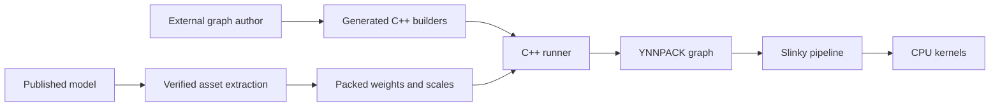

# YNNPACK model lab

A research and benchmarking lab to help the **XNNPACK/YNNPACK team understand
full-model performance gaps**. It provides runnable workloads, retained
measurements, kernel evidence, and bug reproductions for investigating YNNPACK
and Slinky execution. **There are no plans to ship this code for production.**

**Gemma4 E2B and E4B** are the current integrated workloads, using published
packed INT2/INT4/INT8 weights, static QAT activation scales, and INT8 KV cache.
Experiments examine symbolic dimensions, runtime scalar bounds, state mutation,
views, preparation costs, and memory use. Classical vision workloads are planned
as the lab expands.

Start with the [performance gaps and investigation priorities](docs/PERFORMANCE_GAPS.md)
and the [measurement index](results/README.md). The current
[October 7 mobile baseline](results/2026-10-07-upstream-refresh/README.md) adopts
upstream `d297c798ea53`, including the merged cost model. It retimes E2B on all
three phones and E4B on TECNO against fresh previous-pin controls, with fresh
native E2B comparisons, numerical checks and separate execution/kernel profiles.
Linux and host-only HF timings were skipped because the host was busy. Upstream
now disables INT2 I8MM pending a compatible packing layout; the known-row packing
correction remains applied.

The historical
[October 5 backend refresh](results/2026-10-05/README.md) compares the previous
and adopted dependencies using identical current builders and token IDs. The
adopted backend selects AVX-VNNI INT4/INT8 and substantially improves desktop
prefill. Its initial E2B phone runs show a decode regression. The retained
[packing correction](results/2026-10-05-packing-fix/README.md) uses the known
decode row count and restores one-row DOTPROD selection on both tested phones,
with higher observed decode throughput. Desktop speed is essentially unchanged;
desktop numerical differences, phone thermal effects, INT2 decode, preparation,
and memory remain investigation targets. The
original comparisons against XNNPACK retain their historical configurations and
activation contracts. The [publication guide](docs/PUBLICATION.md) identifies
the source and evidence to share and the local material to exclude.

The [fresh phone decode comparison](results/2026-10-05-decode-profile/README.md)
adds Samsung SM-S937U1 and repeats focused Pixel/TECNO cases against the preserved
native Tensor API/XNNPACK runner. Separate execution profiles identify FC,
live-history attention/packing, and outside-callback work. Samsung CPUinfo
correctly detects Oryon; its I8MM selection differs from the native DOTPROD
control. Use the [execution profiling guide](docs/PROFILING.md) to collect and
analyze diagnostic data alongside unprofiled latency measurements.

The [Samsung Oryon kernel-selection study](results/2026-10-05-oryon-dot-selection/README.md)
traces the native DOTPROD tables and YNNPACK's learned I8MM ranking. Its fitting
script excludes one-row DOTPROD kernels, and the I8MM training benchmark uses
full row tiles. Compatible one-row kernel and model experiments examine the
resulting decode choices. The selection restriction is an optional experiment;
the study retains its original dependency configuration. The October 7 upstream
baseline's kernel availability is recorded separately.

**Direct safetensors loading is supported for Gemma4 E2B.** The native C++
runner reads the downloaded
[google/gemma-4-E2B-it-qat-mobile-transformers checkpoint](https://huggingface.co/google/gemma-4-E2B-it-qat-mobile-transformers)
from its original safetensors storage. The
[safetensors quickstart below](#run-gemma4-e2b-directly-from-safetensors) uses
**`hf_static_int8_published_kv`**, the preferred integer-FC profile for ongoing
compiler/dynamism work. BF16 and FP32 profiles remain arithmetic controls.
The [October 5 integer-FC measurements](results/2026-10-05/README.md)
approach the published-source YNNPACK control's warm x86-64 speed. Higher RSS,
cross-implementation numerical differences, and the global KV scale convention
remain open questions; see the [HF design and validation](docs/HF_GEMMA4.md).
Those host-only profiles were not retimed for the October 7 pin.

The standalone C++ runner invokes YNNPACK directly. CMake builds the checked-in
C++ graph builders against pinned, locally patched YNNPACK/Slinky. Large builders
use small declaration headers and separate source files with named layer,
attention, SDPA, and MLP construction functions. Graph authors
and compiler integration are maintained in a separate private repository. This
repository publishes standalone builders and runtime helpers; building and
running them needs no private compiler or Python authoring package. See
[builder artifacts](docs/AUTHORING.md) for their interface and validation.

The checked-in model builders use the `target_views` offline preparation policy:
shared constant deduplication and graph simplification, scheduled attention masks,
and eligible reshape-to-view lowering. Each generated `model.json` records the
policy and operation counts. Decode attention transposes that only move singleton
dimensions are replaced by reshapes/views; fully connected weight-layout
transposes remain available to backend packing. Building and running these
artifacts needs no compiler; model weights, quantization profiles, and invocation
flags are the same as the documented controls.

The [original E2B measurements](docs/MEASUREMENTS.md) include per-request timings,
portable command records, artifact hashes, and sampled kernel summaries in
`results/2026-10-02/`. The comparison controls are external preserved artifacts;
this repository builds the standalone YNNPACK workloads.

## Build and test on Linux

Requirements: Git, Python 3.11+, [uv](https://docs.astral.sh/uv/getting-started/installation/),
CMake 3.20+, Ninja, a recent Clang toolchain,
and Rust/Cargo 1.87+ for the default native tokenizer build.
The initial validation used Clang 22.1.8 and an x86_64 Linux host. Downloaded
dependency archives are checked against SHA-256 hashes in `dependencies.json`.

```sh
git clone https://github.com/snnn/ynnpack-model-lab.git
cd ynnpack-model-lab
uv sync --locked
uv run --locked python tools/bootstrap.py
uv run --locked cmake -S . -B build -G Ninja \
  -DCMAKE_BUILD_TYPE=Release \
  -DCMAKE_C_COMPILER=clang -DCMAKE_CXX_COMPILER=clang++
uv run --locked cmake --build build --parallel 8
uv run --locked ctest --test-dir build --output-on-failure
```

Python tooling dependencies are declared in `pyproject.toml` and pinned with
package hashes in `uv.lock`. uv installs them into the ignored `.venv/`.
Run CMake configuration through `uv run` so its Python tests use that environment.

Tests do not need model weights. They cover append/view behavior, multi-head
strides, partial chunks, invalid requests, packed FC arithmetic, embedding
unpacking, asset extraction, and native tokenizer/input references. Bootstrap
never changes a system installation. Use `tools/bootstrap.py --no-tokenizers`
and `-DLAB_ENABLE_TOKENIZERS=OFF` for a token-ID-only build without Rust.
Dependencies live in the ignored `.deps/` directory. The repository and runtime
dependencies are public.

The backend pins include the learned dot cost model from
[XNNPACK #11568](https://github.com/google/XNNPACK/pull/11568), merged on
October 7, 2026. The current pin is upstream `d297c798ea53`; older records retain
their original revisions. Existing checkouts should use a fresh dependency and
build directory; see [dependency update instructions](patches/README.md).

## Run Gemma4 E2B directly from safetensors

Download the pinned checkpoint, prepare its verified manifest and small graph
constants, and build the native integer-FC runner. No `.litertlm`/TFLite export
or Torch/Transformers installation is required for this path. At runtime, the
loader maps the original shards and reads packed weights and embeddings; it
creates a derived signed-code cache for matrices that need recoding.

```sh
uvx hf download google/gemma-4-E2B-it-qat-mobile-transformers \
  config.json model.safetensors \
  --revision dd693ff40353f057ca5f07e945ad867f4afbf2ec \
  --local-dir assets/hf-checkpoint
python3 tools/prepare_gemma4_hf.py \
  --hf-model-dir assets/hf-checkpoint \
  --output assets/gemma4_e2b_hf/manifest.json

python3 tools/bootstrap.py --directory .deps/hf --hf-bf16
cmake -S . -B build-hf -G Ninja \
  -DCMAKE_BUILD_TYPE=Release \
  -DCMAKE_C_COMPILER=clang -DCMAKE_CXX_COMPILER=clang++ \
  -DLAB_DEPS="$PWD/.deps/hf" -DLAB_BUILD_HF=ON
cmake --build build-hf --parallel 8 \
  --target gemma4_e2b_hf_static_int8_published_kv

./build-hf/gemma4_e2b_hf_static_int8_published_kv \
  --hf_model_dir=assets/hf-checkpoint \
  --asset_manifest=assets/gemma4_e2b_hf/manifest.json \
  --parameter_dir=assets/gemma4_e2b_hf/parameters \
  --cache_dir=assets/gemma4_e2b_hf/derived \
  --cases_file=models/gemma4_e2b_hf/fixtures/performance.tsv \
  --output_dir=out/hf-static-performance \
  --cache_capacity=2048 --num_threads=4 --prefill_rows=128 \
  --warmup_runs=1 --measured_runs=3
```

The HF dependency tree applies the retained BF16 rounding patch and stays
separate from the published-bundle control. This quickstart uses token-ID
fixtures; native text inputs additionally require a prepared tokenizer directory.
The preferred profile accepts BF16 source global PLE projection weights and
uses the published-compatible INT8 KV policy. Follow
[HF_GEMMA4.md](docs/HF_GEMMA4.md) for other profiles, correctness/reference runs,
memory interpretation, and numerical limits. Preserve the E2B/E4B bundle controls
when comparing these different arithmetic policies.

## Prepare Gemma4 E2B from the published bundle

The runner accepts text prompts, JSONL text cases, and exact-length corpus
matrices through native HF/SentencePiece tokenizers. See
[text inputs and tokenizers](docs/TOKENIZERS.md) for asset recipes, usage,
Qwen tokenizer support, and Android Rust prerequisites.

Download the exact published artifact used for these builders. Follow the model
publisher's access and license requirements. Weights are not included here.

```sh
uvx hf download litert-community/gemma-4-E2B-it-litert-lm \
  gemma-4-E2B-it.litertlm \
  --revision 2a101e00c47f942975ce8b493c2498311ed9900d \
  --local-dir assets/download
python3 tools/prepare_gemma4.py \
  --model assets/download/gemma-4-E2B-it.litertlm \
  --output assets/gemma4_e2b
```

Expected source: 2,583,085,056 bytes, SHA-256
`ab7838cdfc8f77e54d8ca45eadceb20452d9f01e4bfade03e5dce27911b27e42`.
Allow several GB of disk space for the source and extracted assets.

The preparer uses a hash-pinned extraction recipe. It verifies the whole source
file, copies weight/scale byte ranges, interleaves the PLE partitions by token,
and verifies every unique output payload. There is no requantization, calibration,
or conversion of integer weights to float weights. Identical payloads share hard
links. The script needs only Python's standard library. A different model file
requires a new extraction recipe and validation; renaming it is insufficient.

## Run the published-bundle control

```sh
./build/gemma4_e2b \
  --bundle_dir=assets/gemma4_e2b/bundle \
  --parameter_dir=assets/gemma4_e2b/parameters \
  --cases_file=models/gemma4_e2b/fixtures/performance.tsv \
  --output_dir=out/linux-c2048-t4 \
  --cache_capacity=2048 --num_threads=4 --prefill_rows=128 \
  --warmup_runs=1 --measured_runs=3
```

Use a fresh output directory per run. Change `--cache_capacity` to 8448 to test
capacity independently of live history. `--prefill_rows` accepts 1–128; short
final chunks contain real tokens only. The generated prefill contract has a
128-row maximum. Larger chunks require reauthoring and an explicit contract
change. Each process prepares prefill/decode once and reuses them across requests.

The input TSV has three columns: case name, comma-separated prompt token IDs,
and comma-separated forced continuation IDs (`-` for none). These are benchmark
fixtures, not a tokenizer/chat frontend. Prefill processes all but the last prompt
token; decode processes that last token to produce first logits. Continuation
tokens are teacher-forced, so this does not test free-generation quality.

`timings.jsonl` includes prefix time, per-token time, graph setup, RSS, argmax,
and KV append/view-copy counters. Use `--dump_outputs` for logits and live KV
dumps, or `--dump_pipeline` for Slinky IR. Dumps add overhead: disable them for
timing. See [benchmark methodology](docs/BENCHMARKING.md).

## Android: the same CMake build

Set `ANDROID_NDK` to your NDK installation. Validated with NDK r28c
(28.2.13676358), ARM64, API 28, static libc++. SME/SME2 and FP8 are disabled in
this initial experiment; DOTPROD and I8MM remain enabled.

```sh
cmake -S . -B build-android -G Ninja \
  -DCMAKE_TOOLCHAIN_FILE="$ANDROID_NDK/build/cmake/android.toolchain.cmake" \
  -DANDROID_ABI=arm64-v8a -DANDROID_PLATFORM=android-28 \
  -DANDROID_STL=c++_static -DCMAKE_BUILD_TYPE=Release
cmake --build build-android --parallel 8

adb -s "$ANDROID_SERIAL" shell mkdir -p /data/local/tmp/ynnpack-model-lab
adb -s "$ANDROID_SERIAL" push build-android/gemma4_e2b \
  build-android/state_views_test build-android/quantized_fc_test \
  build-android/model_assets_test /data/local/tmp/ynnpack-model-lab/
adb -s "$ANDROID_SERIAL" push assets/gemma4_e2b/bundle \
  assets/gemma4_e2b/parameters models/gemma4_e2b/fixtures \
  /data/local/tmp/ynnpack-model-lab/
adb -s "$ANDROID_SERIAL" shell 'cd /data/local/tmp/ynnpack-model-lab && \
  mkdir -p state-results && ./state_views_test state-results && \
  ./quantized_fc_test && ./model_assets_test'
adb -s "$ANDROID_SERIAL" shell 'cd /data/local/tmp/ynnpack-model-lab && \
  ./gemma4_e2b --bundle_dir=bundle --parameter_dir=parameters \
  --cases_file=fixtures/performance.tsv --output_dir=c2048-t4 \
  --cache_capacity=2048 --num_threads=4 --prefill_rows=128 \
  --warmup_runs=1 --measured_runs=3'
adb -s "$ANDROID_SERIAL" pull \
  /data/local/tmp/ynnpack-model-lab/c2048-t4 out/android-c2048-t4
```

ADB may materialize separate copies of hard-linked weights. Check device storage
before pushing. The executable can take tens of seconds to prepare its graphs.

## Gemma4 E4B

Build `gemma4_e4b` with the same CMake commands, prepare assets with
`--variant e4b`, and use its model-specific fixtures. E4B has two KV heads,
INT2 PLE, and a considerably larger current runtime footprint. See
[E4B instructions and validation](docs/E4B.md) before running it on a phone.

## Architecture and scope



One prepared graph handles each phase. The host supplies real query rows,
position, and capacity-backed buffers. Symbolic expressions define append
positions and attention intervals. Cache updates copy only newly generated K/V;
the runner checks 9,216 appended bytes per token for E2B, 28,672 for E4B,
and zero view-copy callbacks.
Attention still reads history and can pack/dequantize it internally. This is
chunked attention, not online-softmax/FlashAttention.

- [Design and model extension](docs/DESIGN.md)
- [Standalone builder artifacts](docs/AUTHORING.md)
- [Benchmarking](docs/BENCHMARKING.md)
- [Execution profiling](docs/PROFILING.md)
- [Earlier comparative measurements](docs/MEASUREMENTS.md)
- [Standalone validation](docs/VALIDATION.md)
- [Dependency patches](patches/README.md)

Possible future experiments include Gemma3, Qwen, a packed-weight disk cache,
and tiled online-softmax attention. These are research directions, not a
production roadmap. E2B and E4B are integrated end to end for benchmarking.

## Licensing

Lab code is Apache-2.0; retained third-party notices and licenses are listed in
`NOTICE` and `third_party/`. Model weights have their own publisher's terms.
Graph-authoring sources and compiler integration are maintained separately and
are excluded from this repository. Generated builders and their standalone
runtime helpers retain the applicable notices and licenses.
